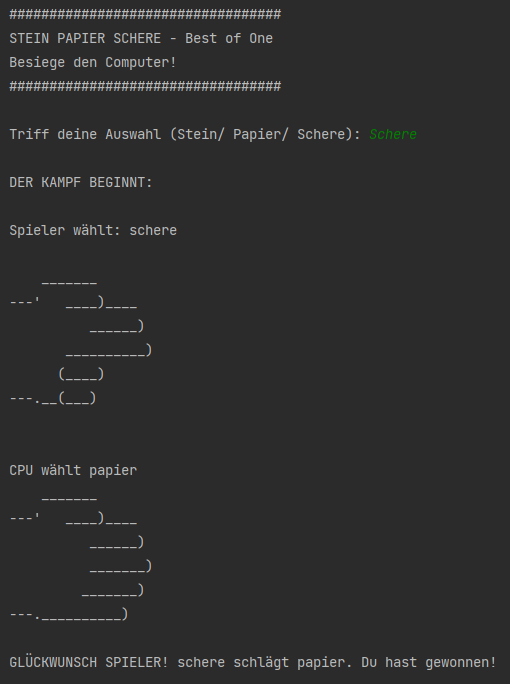

# 004-rock-paper-scissors
100 Days of Code - Day 4: Rock, Paper, Scissors

Rock, Paper, Scissor Game vs. Random module

Learned:
- Random module
- Offset and appending items to lists
- Index errors
- Nested lists
